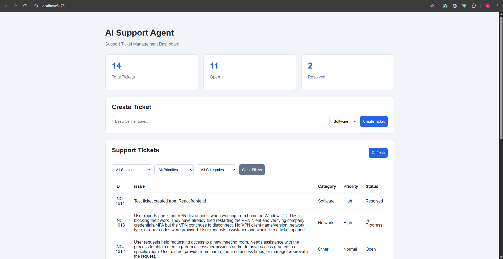
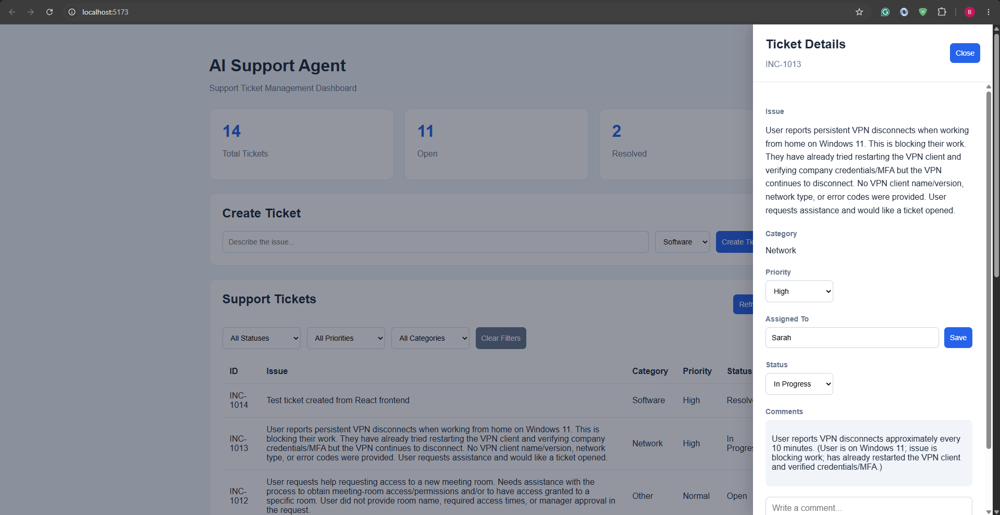

# AI Support Agent

A full-stack AI-powered IT support application built with React, ASP.NET Core, and SQLite.

The application combines an AI support assistant with a ticket management dashboard, allowing users to troubleshoot issues and manage support tickets.

## Tech Stack

**Frontend**
- React
- JavaScript
- Vite
- CSS

**Backend**
- C#
- ASP.NET Core Web API
- Entity Framework Core
- SQLite
- OpenAI API

## Features

### AI Support Assistant
- AI-powered IT troubleshooting conversations
- Knowledge base lookup
- Conversation history management
- Tool/function calling for support workflows
- User confirmation before sensitive actions

### Ticket Management Dashboard
- View support tickets and dashboard statistics
- Create new support tickets
- Filter tickets by status, priority, and category
- View ticket details in a sliding side panel
- Update ticket status and priority
- Assign tickets to technicians
- Add and view ticket comments
- Persist ticket information in SQLite

## Project Structure

```text
AISupportAgent/
├── AISupportAgent/     # ASP.NET Core backend
├── frontend/           # React frontend
├── AISupportAgent.slnx
└── README.md
```

## Getting Started

### Prerequisites

- .NET SDK compatible with the backend project
- Node.js and npm
- Visual Studio 2022 or VS Code

### Backend

1. Open `AISupportAgent.slnx` in Visual Studio.
2. Configure the required application settings and API credentials.
3. Restore NuGet packages.
4. Start the ASP.NET Core application.

### Frontend

Open a terminal in the `frontend` directory:

```bash
npm install
npm run dev
```

Open the local URL displayed by Vite, usually:

http://localhost:5173

The React application communicates with the ASP.NET Core REST API.

## Screenshots

## Screenshots

### Support Ticket Dashboard


### Ticket Details


## Future Improvements

- Authentication and role-based access control
- Improved ticket search and sorting
- Automated tests
- Cloud deployment

## Author

**Matthew (Bohong) Liu**

[LinkedIn](https://www.linkedin.com/in/bohong-liu-2511a610b/) | [GitHub](https://github.com/Bochum0913)
